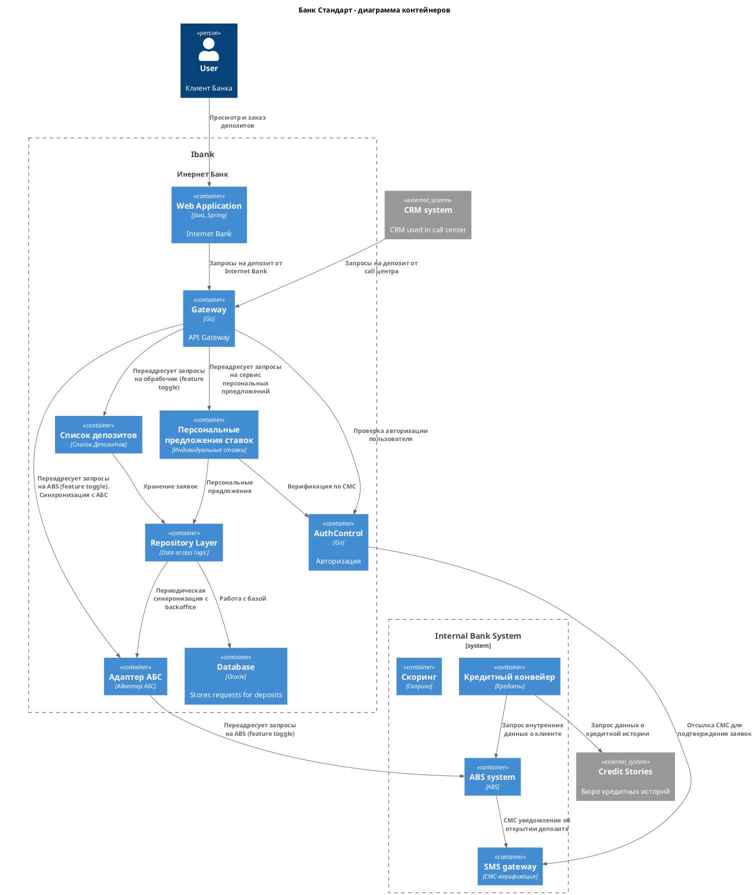

### **Название задачи:** Таск3
### **Автор:** Полесин Максим
### **Дата:** 08.02.2026
### **Функциональные требования**
Опишите здесь верхнеуровневые Use Cases. Их нужно оформить в виде таблицы с пошаговым описанием:

| **№** | **Действующие лица или системы** | **Use Case** | **Описание** |
|:-:    |:--------------------------------:|:-:|:-:|
| UC1  | Новый Пользователь  | Подача заявки на депозита в интернет банке | <ol><li>Просматривает доступные депозиты</li><li>Вводит ФИО и телефон</li>  <li>Получает звонок</li></ol> |
| UC2  | Сущ. польз| Открытие Депозита в интернет банке | <ol><li>Просматривает доступные депозиты с персонализированными ставками</li><li>Указывает счет и сумму</li><li>Подает заявку на депозит</li><li>Подтверждает операцию по СМС</li></ol> |

### **Нефункциональные требования**
Опишите здесь нефункциональные требования и архитектурно значимые требования.

|**№**|**Требование**|
| :-: | :- |
| U1  |  Интерфейс должен придерживаться системы дизайна для приложений, которая принята в компании. Пользователи при работе должны видеть привычные цвета и брендированные элементы.               |
|  U2  |   |
| +R9  | Все сервисы должны работать 24/7 и быть доступны в 99,9% случаев. Допущение: пока не может быть реализовано для сбоев в ЦОД |
| +R10 | Избежать прямой работы интернет-банка с API АБС в новом процессе. |

Остальные архитектурно-значимые требования см. в FURPS+

### **Решение**
Приведите диаграммы контекста и контейнеров в модели C4. Опишите там основные компоненты и интеграции всех элементов решения. 

Также опишите, какой логикой вы руководствовались в ходе принятия решений и выбора технологий. Не забывайте, что необходимо учесть все функциональные и нефункциональные требования.

Для плавности перехода на новые системы был выбран паттерн Strangler Fig. На данном этапе предусмотрен только перевод заявок на депозиты на новые технологии. Остальное должно работать, как ни в чем не бывало.
Будет реализовано постепенное переключение запросов от CRM системы на новые сервисы вместо прямого обращения в АБС. Все новые запросы от интернет банка могут сразу направляться на новые сервисы, а не на АБС (которая и так перегружена).
Поскольку нет требования "мгновенности", мы можем реализовать интеграцию с АБС периодической синхронизацией, чтобы не увеличивать нагрузку на АБС.

### **Альтернативы**
Использование Кафка пока отложено. На этапе MVP остаются ручные подтверждения в АБС.
Также АБС перегружена и скорее всего не сможет обрабатывать сообщения в реальном времени все равно.

**Недостатки, ограничения, риски**

Процесс остается не полностью автоматизированым. Депозит требует подтверждения менеджером бэкофиса.
Пока будем использовать синхронный API для простоты и в отсутствии необходимости полной асинхронности на этапе MVP.

Доработки АБС не полностью ясны. Внедрение функциональности "Excel" в АБС вынесено из MVP. Это может задерживать процесс при большом наплыве пользователей.

Расчет индивидуальных ставок может перегрузить систему скоринга - планируется производить расчеты в ночное время.

Нововведения могут вызвать повышенную нагрузку на call-центры.

Внесение изменений в АБС остается рискованным (монолит)
